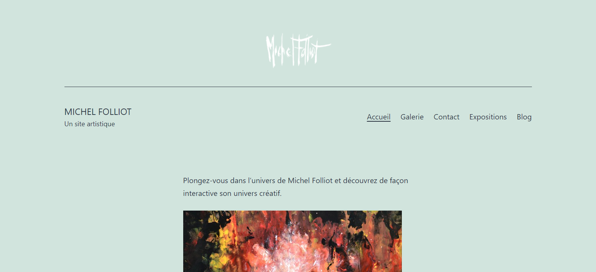

# Notre site Wordpress

**But** : L'objectif étant d'améliorer certaines choses dans un site artistique de notre choix.

**Consignes** : https://slamwiki2.kobject.net/ateliers/missions/refonte

**Language** : HTML, CSS, PHP

**Phot de notre site** : 

**Installation** : Pour accéder au site, écrire cette url dans un moteur de recherche : http://62.210.83.115:11206/wordpress/

Réalisation du site par Mathis Pépin et Lucas Lemarié pour un projet de BTS SIO au Supavenir St Ursule à Caen.
